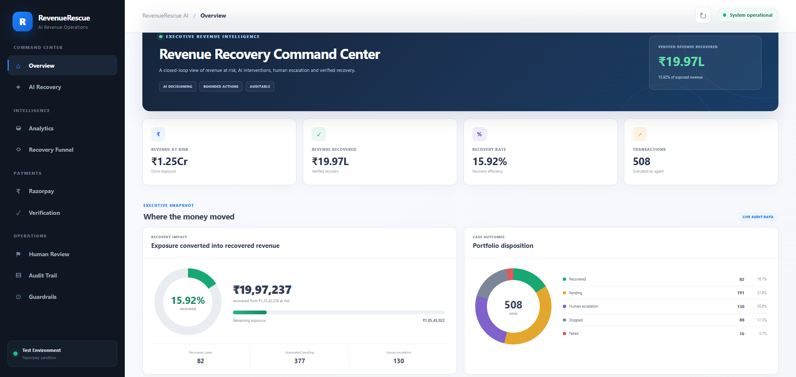
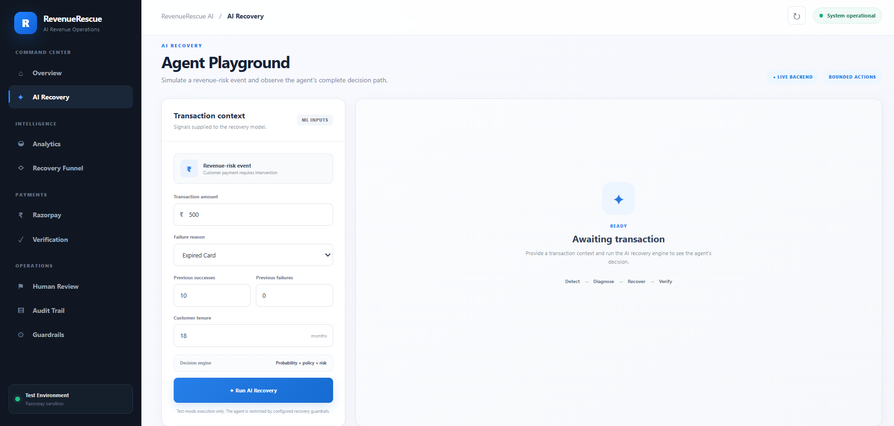
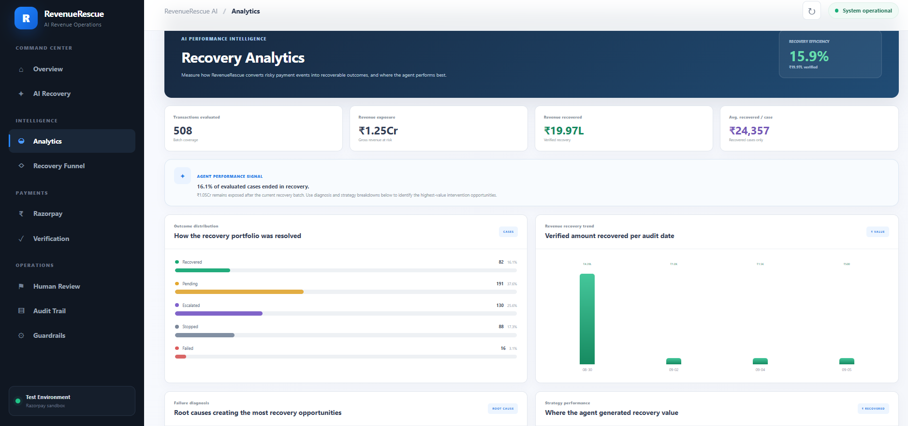
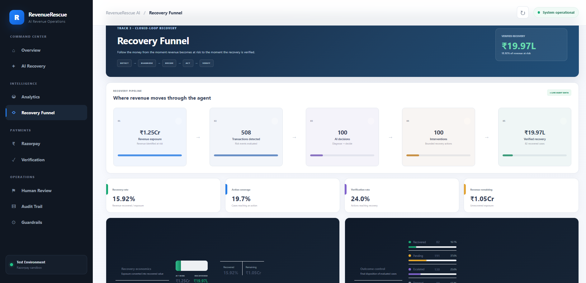
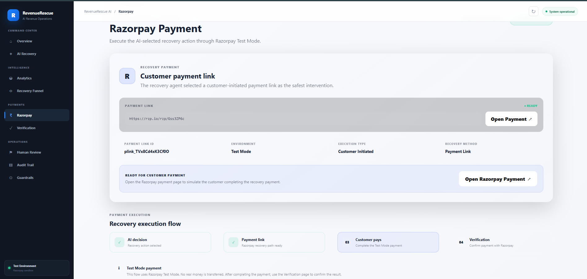
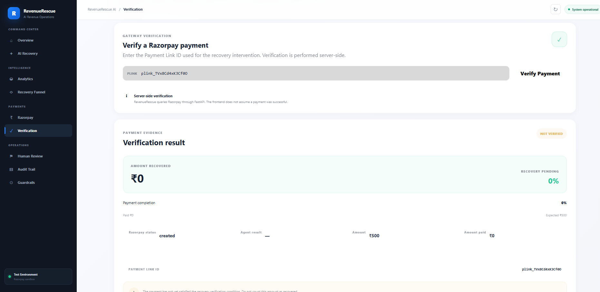
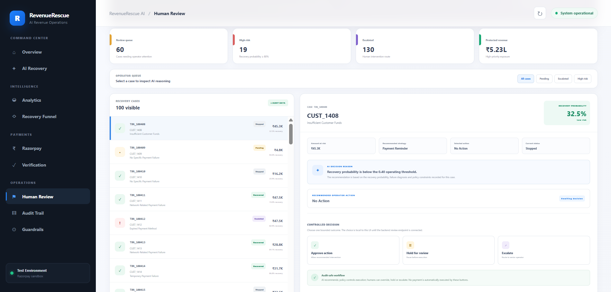
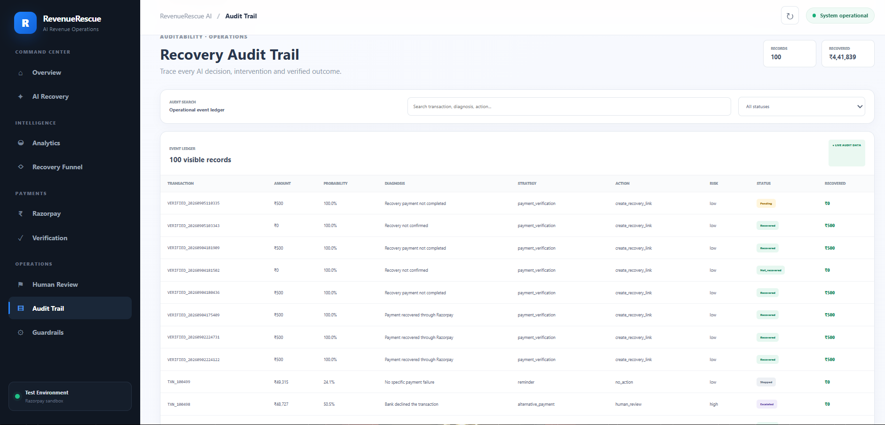
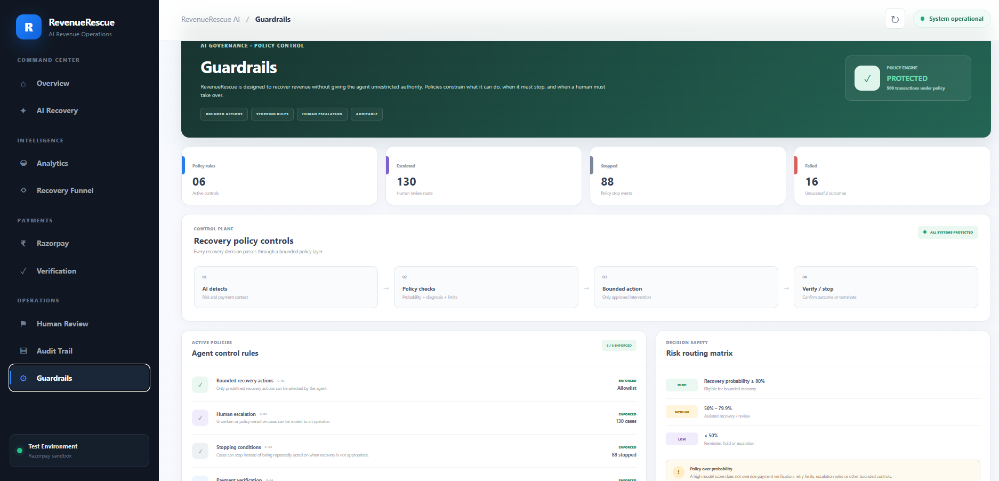

# RevenueRescue AI

### AI-Powered Revenue Recovery and Payment Failure Intelligence

RevenueRescue AI is an AI-driven revenue recovery system designed to help businesses identify at-risk payments, understand why payments fail, select the most appropriate recovery action, execute recovery through Razorpay Test Mode, verify the payment outcome, and maintain a complete audit trail.

The system focuses on one simple question:

> How can businesses recover revenue that would otherwise be lost?

---

## Problem Statement

Payment failures can directly affect business revenue.

A failed payment does not always mean that the customer will never pay. The failure may be caused by:

- Temporary payment issues
- Customer behaviour
- Payment method problems
- Insufficient funds
- Technical failures
- Expired payment attempts
- Other transaction-related conditions

Traditional payment systems may simply mark these transactions as failed.

RevenueRescue AI goes one step further by treating a failed payment as a potential **recovery opportunity**.

The system analyzes the payment risk, predicts recovery probability, identifies the likely failure reason, and recommends a bounded recovery action.

---

# Solution

RevenueRescue AI follows the complete recovery lifecycle:

**Detect → Predict → Diagnose → Decide → Execute → Verify → Measure → Audit**

The system does not consider a recovery successful simply because an action was triggered.

A recovery is counted only after the payment outcome is verified.

---

# Core Workflow

```text
Revenue at Risk
      |
      v
Risk Detection
      |
      v
Recovery Probability
      |
      v
Failure Diagnosis
      |
      v
AI Recovery Decision
      |
      v
Guardrails
      |
      v
Razorpay Test Mode
      |
      v
Payment Verification
      |
      v
Recovered Revenue
      |
      v
Audit Trail + Analytics
Key Features
1. Revenue Risk Detection

The system identifies transactions that may result in lost revenue.

Instead of treating every transaction equally, RevenueRescue AI focuses attention on cases where recovery may be possible.

2. Recovery Probability

The AI estimates the likelihood that a payment can be successfully recovered.

This allows the system to prioritize recovery opportunities instead of applying the same strategy to every customer.

Example:

Customer Payment
       |
       v
Recovery Probability
       |
       +---- High ----> Automated Recovery
       |
       +---- Medium --> Controlled Recovery / Review
       |
       +---- Low -----> Hold / Escalate
3. Failure Diagnosis

RevenueRescue AI attempts to understand the reason behind a failed payment.

The diagnosis helps the system select a more appropriate recovery strategy.

For example:

Payment Failure
      |
      +--> Temporary issue
      |
      +--> Customer action required
      |
      +--> Payment method issue
      |
      +--> Other failure
4. AI Recovery Decision

The AI combines the available transaction information, recovery probability, and failure diagnosis to determine what should happen next.

The system is designed around:

AI decides what to do.
Razorpay executes the payment action.
Verification proves whether money was actually recovered.

5. Bounded Recovery Actions

The AI does not have unrestricted control.

Recovery actions are constrained by predefined guardrails.

Possible outcomes include:

Proceed with recovery
Request another payment attempt
Hold the case
Send for human review
Escalate the case
Stop recovery when confidence is insufficient

This prevents aggressive or unnecessary automated actions.

Razorpay Integration

RevenueRescue AI integrates with Razorpay Test Mode for payment execution and verification.

The integration is used to demonstrate a real payment recovery workflow without using production customer funds.

The flow is:

RevenueRescue AI
      |
      v
Recovery Decision
      |
      v
Razorpay Payment Link
      |
      v
Customer Payment
      |
      v
Razorpay
      |
      v
Payment Verification

The application uses Razorpay Payment Links to execute the payment recovery flow.

For demonstration purposes, the project can reuse an existing Test Mode Payment Link when the Test Mode Payment Link creation limit has been reached.

Payment Verification

A major part of RevenueRescue AI is separating action from outcome.

Creating or sending a payment link does not automatically mean that revenue was recovered.

The verification layer checks the Razorpay payment information and determines whether the payment was:

Recovered
Partially recovered
Pending
Failed
Unknown

A recovery is counted only when the payment information confirms successful payment.

This prevents the dashboard from reporting false recovered revenue.

Recovery Funnel

The Recovery Funnel shows the complete journey of money through the system.

At-Risk Revenue
      |
      v
Recovery Candidates
      |
      v
Recovery Actions
      |
      v
Payment Attempts
      |
      v
Verified Recoveries

This allows the user to understand where revenue is being lost or recovered.

Human Review

Not every case should be handled automatically.

RevenueRescue AI includes a Human Review stage for cases where automated action may not be appropriate.

A case can be:

Approved
Held
Escalated
Reviewed manually

This creates a human-in-the-loop recovery process.

Guardrails

Revenue recovery should not become uncontrolled automation.

RevenueRescue AI therefore applies guardrails around AI decisions.

The guardrail layer is responsible for:

Limiting automated actions
Preventing unnecessary recovery attempts
Handling low-confidence predictions
Escalating uncertain cases
Supporting human review
Requiring payment verification
Maintaining an audit trail
Preventing false recovery reporting

The principle is:

Automate where confidence is high. Escalate where confidence is low.

Audit Trail

Every recovery attempt should have an explainable record.

The Audit Trail records important information about the recovery process, including:

Recovery attempt
Decision
Action taken
Payment status
Recovered amount
Verification result
Outcome

Both successful and unsuccessful or incomplete recovery attempts are retained.

This makes the recovery process more transparent and auditable.

Analytics

The Analytics section provides a portfolio-level view of recovery performance.

It can be used to understand:

Revenue at risk
Recovery opportunities
Recovery attempts
Verified recovered revenue
Recovery funnel performance
Strategy performance
Recovery outcomes

The goal is to move beyond individual transactions and understand overall recovery effectiveness.

Application Screenshots
Revenue Recovery Command Center



The main dashboard provides an overview of revenue recovery activity and key metrics.

AI Recovery



The AI Recovery page shows the AI-driven recovery decision process.

Recovery Analytics



The Analytics page provides a broader view of recovery performance.

Recovery Funnel


The Recovery Funnel visualizes the movement from revenue risk to verified recovery.

Razorpay Execution



The Razorpay page demonstrates the payment execution stage.

Payment Verification



The Verification page confirms whether the payment was actually recovered.

Human Review



The Human Review page provides a controlled workflow for cases requiring human judgement.

Audit Trail



The Audit Trail records recovery attempts and their outcomes.

Guardrails


The Guardrails page demonstrates the controls applied around automated recovery decisions.

System Architecture

RevenueRescue AI is organized into several layers.

Layer	Responsibility
Frontend	Provides the dashboard and recovery workflow UI
Backend API	Coordinates requests and application logic
AI / ML	Predicts recovery probability and supports diagnosis
Recovery Agent	Determines the appropriate recovery action
Guardrails	Restricts unsafe or inappropriate automation
Razorpay	Executes payment actions in Test Mode
Verification	Confirms the actual payment outcome
Audit Trail	Records recovery decisions and results
Analytics	Measures recovery performance
AI Decision Flow

The recovery agent follows a structured decision process.

Step 1 — Detect

Identify a transaction that may represent revenue at risk.

Step 2 — Predict

Estimate the probability of successful recovery.

Step 3 — Diagnose

Determine the likely reason for the payment failure.

Step 4 — Decide

Select an appropriate recovery action.

Step 5 — Apply Guardrails

Check whether the proposed action is allowed.

Step 6 — Execute

Execute the payment recovery action through Razorpay Test Mode.

Step 7 — Verify

Check the actual Razorpay payment result.

Step 8 — Measure

Calculate the verified recovered amount.

Step 9 — Audit

Record the decision and final outcome.

Technology Stack
Frontend
React
Vite
JavaScript
HTML
CSS
Backend
Python
FastAPI
AI / Machine Learning
Python-based prediction and decision logic
Recovery probability analysis
Failure diagnosis
AI recovery agent
Payments
Razorpay Test Mode
Razorpay Payment Links
Payment verification
Data & Analytics
Structured transaction data
Recovery records
Analytics and funnel metrics
Project Structure
RevenueRescue-AI/
│
├── backend/
│   ├── api.py
│   ├── agent.py
│   ├── razorpay_client.py
│   │
│   ├── payments/
│   │   └── payment_link.py
│   │
│   ├── ml/
│   │
│   └── data/
│
├── frontend/
│   └── src/
│
├── docs/
│   └── screenshots/
│       ├── ai-recovery.png.png
│       ├── analytics.png.png
│       ├── audit-trail.png.png
│       ├── dashboard.png.png
│       ├── guardrails.png.png
│       ├── human-review.png.png
│       ├── razorpay.png.png
│       ├── recovery-funnel.png.png
│       └── verification.png.png
│
├── .env.example
├── .gitignore
└── README.md
Getting Started
Prerequisites

Make sure the following are installed:

Python
Node.js
npm
Git

You also need a Razorpay Test Mode account for payment integration.

Backend Setup

Open a terminal in the project directory.

cd RevenueRescue-AI

Create a virtual environment:

python -m venv venv312

Activate it on Windows:

.\venv312\Scripts\Activate.ps1

Install the required Python dependencies:

pip install -r backend/requirements.txt

If the project uses a different requirements file, install the dependencies specified by the backend environment.

Environment Variables

Create a .env file in the project root.

Example:

RAZORPAY_KEY_ID=your_test_mode_key_id
RAZORPAY_KEY_SECRET=your_test_mode_key_secret
RAZORPAY_DEMO_PAYMENT_URL=your_demo_payment_url
RAZORPAY_DEMO_PAYMENT_LINK_ID=your_demo_payment_link_id

Do not commit the .env file to GitHub.

Use .env.example as the template for required environment variables.

Run the Backend

The FastAPI application is located at:

backend/api.py

Run the backend using:

uvicorn backend.api:app --reload

The backend will normally be available at:

http://127.0.0.1:8000
Run the Frontend

Open another terminal.

cd frontend

Install frontend dependencies:

npm install

Start the development server:

npm run dev

Open the URL shown by Vite in the terminal.

Demo Flow

A typical demonstration of RevenueRescue AI can follow this sequence:

1. Open the Dashboard

Start with the Revenue Recovery Command Center.

Show the overall revenue recovery metrics.

2. Open AI Recovery

Select a revenue-at-risk case.

Show the AI's recovery probability and diagnosis.

3. Show the Recovery Decision

Explain why the AI selected the proposed recovery action.

4. Show Guardrails

Demonstrate that the AI decision is bounded by predefined rules.

5. Execute Through Razorpay

Trigger the Test Mode payment recovery flow.

6. Complete the Payment

Use the Razorpay Test Mode payment experience.

7. Verify the Payment

Return to the Verification page.

Show that the payment status is checked using Razorpay information.

8. Show the Recovered Amount

Only the verified successful amount is counted as recovered revenue.

9. Open the Audit Trail

Show that the recovery attempt has been recorded.

10. Show Analytics

Finish by showing the overall recovery funnel and performance.

Design Principles

RevenueRescue AI is built around five principles.

1. Revenue First

Focus on recovering revenue that is genuinely at risk.

2. AI-Assisted Decisions

Use AI to prioritize and recommend recovery actions.

3. Bounded Automation

AI actions operate within predefined guardrails.

4. Verified Outcomes

Do not count an action as successful until the payment result is verified.

5. Full Auditability

Maintain a record of decisions, attempts, and outcomes.

Why This Approach Matters

A payment recovery system should not optimize only for the number of recovery attempts.

The real objective is:

Revenue at Risk
        ↓
Recovery Attempt
        ↓
Successful Payment
        ↓
Verified Revenue

RevenueRescue AI therefore focuses on verified recovered revenue, rather than simply measuring how many payment links or recovery actions were created.

Key Differentiator

Traditional payment failure handling often ends at:

Payment Failed

RevenueRescue AI continues the process:

Payment Failed
      ↓
Understand the Failure
      ↓
Estimate Recovery Probability
      ↓
Choose Recovery Strategy
      ↓
Apply Guardrails
      ↓
Attempt Recovery
      ↓
Verify Payment
      ↓
Measure Recovered Revenue
      ↓
Record Outcome

This transforms payment failure from a static error into an actionable revenue recovery workflow.

Security Notes
Razorpay credentials should be stored in environment variables.
Never commit .env files.
Use Razorpay Test Mode credentials during development and demonstration.
Production payment credentials should never be exposed in source code.
Automated recovery actions should remain subject to guardrails and verification.
Future Enhancements

Potential future improvements include:

More advanced recovery prediction models
Customer-level recovery strategy optimization
Automated notification channels
Webhook-based real-time payment verification
More payment failure classifications
Adaptive recovery strategies
Recovery strategy A/B testing
Production-grade monitoring
Improved explainability for AI decisions
More advanced revenue forecasting